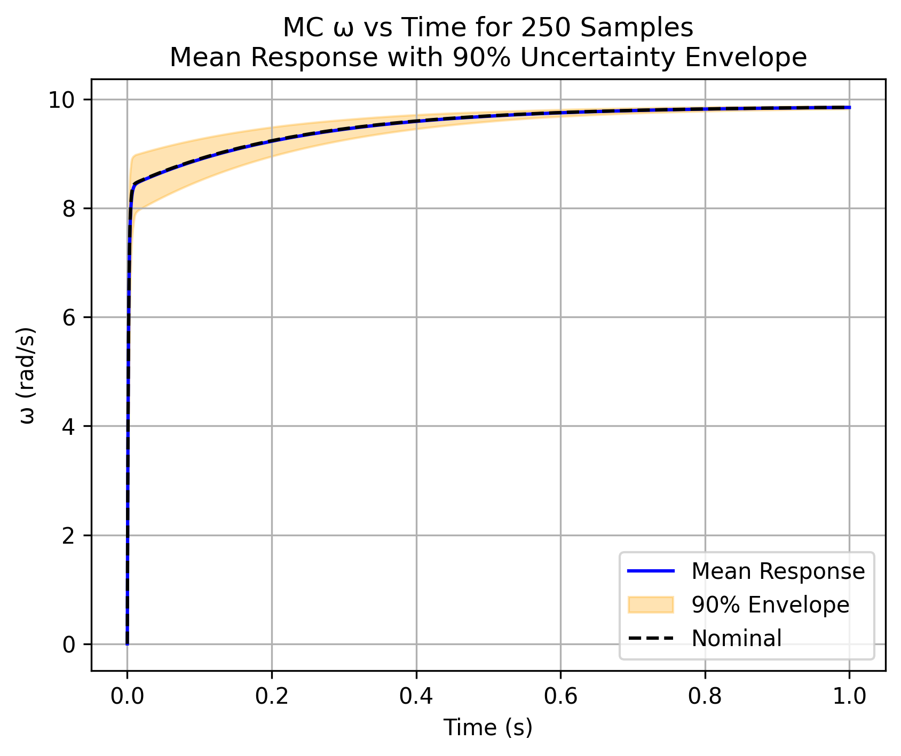
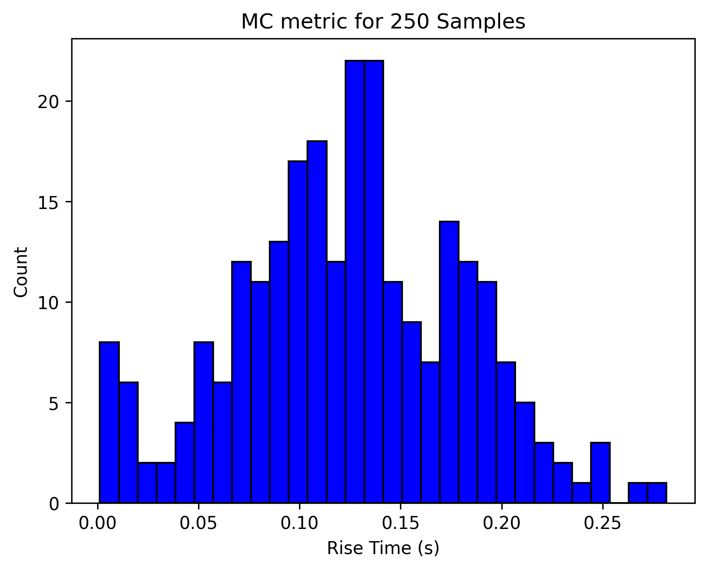
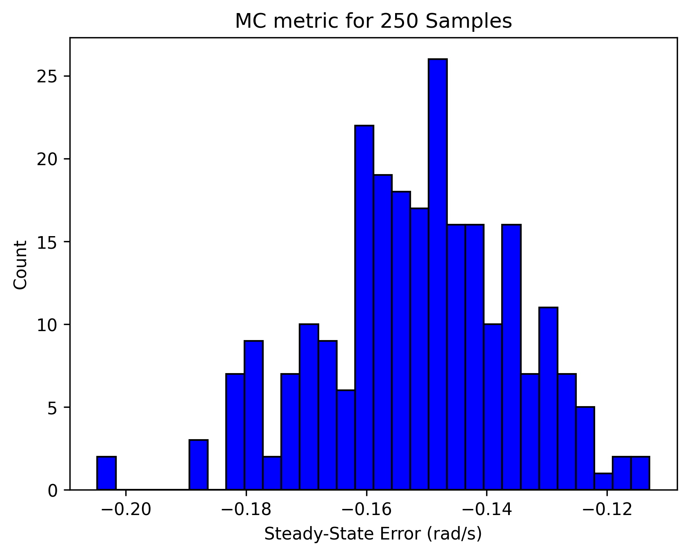

# dc_motor_uq: DC Motor Uncertainty Quantification Package
### Simulation, control, and uncertainty analysis for a DC motor model

`dc_motor_uq` is a modular Python package for simulating a DC motor under parametric uncertainty. It models the motor dynamics, applies a PID controller, and quantifies how variations in physical parameters affect time‑domain performance metrics such as rise time, overshoot, and settling time. The package includes dedicated modules for modeling, sampling, metrics, and visualization, along with a runnable example script (`scripts/run_simulation.py`) that demonstrates the full simulation pipeline — parameter sampling, parallel model execution, metric computation, and visualization — with a modular package architecture. 


## Project Overview
This project analyzes how uncertainty in physical parameters affects the closed‑loop behavior of a DC motor. The package separates the workflow into clear components—modeling, sampling, simulation, metrics, and visualization—mirroring how real autonomy and controls software is structured. By running many perturbed simulations in parallel, the package highlights how variations in resistance, inductance, inertia, and damping influence key performance metrics such as rise time, overshoot, and settling time. The example script ties these components together into a single workflow that demonstrates uncertainty‑aware actuator analysis in a compact, extensible format.

## Why This Matters
Actuators in real robotic systems rarely operate at their nominal parameters — manufacturing tolerances, wear, thermal drift, and environmental conditions all introduce uncertainty. This project models a DC motor as a stochastic system and evaluates how parameter variation propagates through a closed‑loop PID controller. 

This mirrors real workflows in robotics and autonomy, where reliability and robustness depend on understanding not just the nominal trajectory, but the distribution of possible behaviors. The pipeline here reflects the same structure used in actuator testing, controller validation, and simulation‑to‑hardware verification.

## Technical Highlights

This project demonstrates several engineering capabilities relevant to robotics, autonomy, and control systems:

- **Closed‑loop actuator simulation** using a physics‑based DC motor model with real‑time PID control.
- **Uncertainty quantification** across electrical and mechanical parameters using Monte Carlo, Latin Hypercube, and uniform sampling.
- **Parallelized simulation pipeline** using Python’s `ProcessPoolExecutor` for scalable batch evaluation.
- **Time‑domain performance analysis** including rise time, settling time, overshoot, and steady‑state error.
- **Uncertainty‑aware visualization** with credible envelopes, nominal trajectories, and metric histograms.
- **Modular software design** mirroring real autonomy stacks (modeling → sampling → simulation → metrics → visualization).

## Key Features
- **Modular architecture**  — Separate modules for modeling, sampling, simulation, metrics, and visualization.
- **Uncertainty quantification workflow** — parameter sampling, parallel execution, and distribution‑based performance analysis.
- **PID‑controlled motor model** — standard electromechanical dynamics with configurable gains.
- **Performance metrics** — rise time, overshoot, settling time, steady‑state error, and more.
- **Visualization tools** — time‑domain plots, histograms, and distribution summaries.
- **Runnable example script** — end‑to‑end demonstration of the full simulation pipeline using `scripts/run_simulation.py`.

## Package Structure
```
dc_motor_uq/
├── model.py              # Motor dynamics and PID controller
├── sampling.py           # Parameter sampling utilities
├── simulation.py         # Simulation loop and parallel execution
├── metrics.py            # Time-domain performance metrics
├── visualization.py      # Plotting utilities
scripts/
└── run_simulation.py     # End-to-end example workflow
```

## Installation
Clone the repository and install the required Python packages:
```
git clone https://github.com/HailtheWhale/dc_motor_uq.git
cd dc_motor_uq
pip install -r requirements.txt
```

## Requirements
- Python 3.9+
- numpy
- scipy
- matplotlib
- tqdm


## How to Run
Execute the example workflow:

```
python -m scripts.run_simulation
```

## Results

The uncertainty sweep was run using 250 Monte Carlo samples with perturbed electrical and mechanical parameters. The figures below summarize how parameter variation affects the closed‑loop response of the DC motor under PID control.

### Closed‑Loop Speed Response Under Uncertainty
<p align="center">
  
</p>

The mean trajectory and 90% uncertainty envelope show that the PID controller strongly suppresses parameter‑driven variability. Most of the spread appears during the initial acceleration phase (0–0.1 s), where inductance, inertia, and torque constant variation influence current buildup and torque production. After this transient window, the envelope collapses and all trajectories converge toward the target speed.

The nominal (median‑parameter) trajectory lies almost exactly on the mean response, indicating that the parameter distributions are symmetric and the controller is robust to moderate perturbations.

### Rise Time Distribution
<p align="center">
  
</p>

The rise‑time histogram shows a unimodal distribution with most samples between approximately 0.11 and 0.14 seconds, and an overall spread from about 0.02 to 0.24 seconds. The peak occurs around 0.12–0.13 seconds, suggesting a roughly Gaussian‑like distribution centered near 0.125 seconds. This spread reflects the influence of electrical (L, R) and mechanical (J, B) uncertainty on the system’s ability to accelerate toward the target speed.

### Steady‑State Error Distribution
<p align="center">
  
</p>

Most steady‑state errors fall between –0.18 and –0.11 rad/s, with a few outliers near –0.21 rad/s. All values are negative, indicating a small but consistent undershoot relative to the 10 rad/s target. This bias is expected given the relatively small integral gain (Ki = 0.1), which limits the controller’s ability to fully eliminate steady‑state error. The tight clustering of values shows that uncertainty has minimal effect on steady‑state performance — the controller’s bias dominates.

### Metrics With No Meaningful Spread

Two metrics — percent overshoot and settling time — collapsed into single‑bar histograms. This occurred because:

- The controller produced zero overshoot for nearly all parameter samples.
- The settling time was effectively identical across samples due to strong damping and high proportional gain.

These behaviors are consistent with a well‑tuned, overdamped PID loop.


## License

This project is dual‑licensed:

- **CC BY‑NC 4.0** for non‑commercial use.  
- **Commercial licenses** are available upon request.

Non‑commercial users may use, modify, and share the code with attribution.  
Commercial use requires obtaining a separate license from the author.
